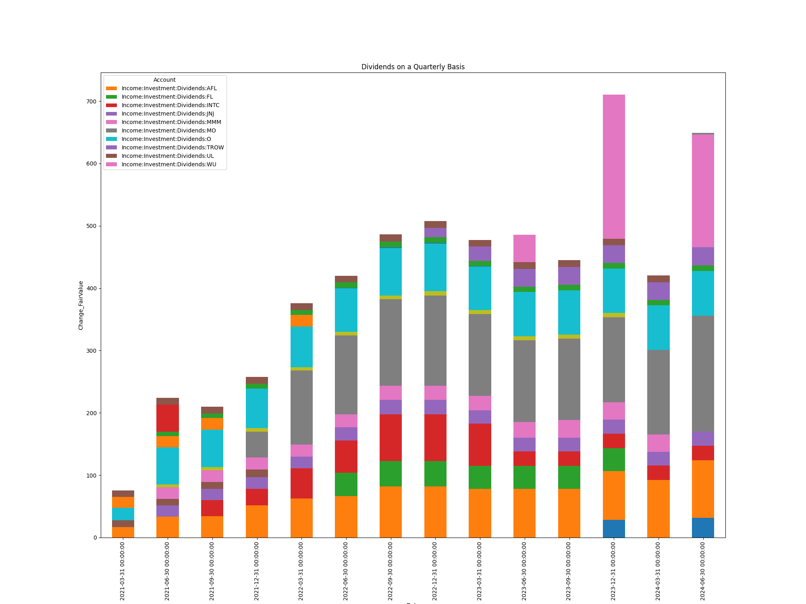
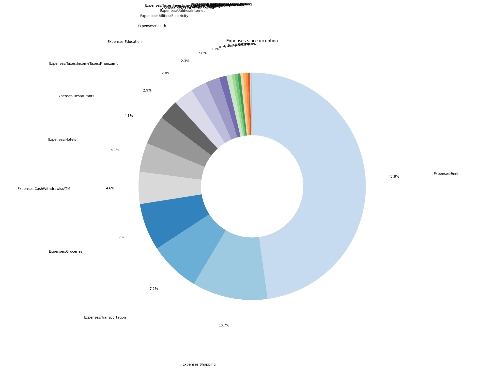

# pyAccounting 

pyAccounting is a personal application that reads bank and brokerage statements, parses them and generates reports based on the data provided.

## How to use

The "Files" folder contains 3 folders:

    - config - Contains all relevant configuration that will determine what will be run
    - input - Contains input files which are referenced by the config and which are read by the program
    - output - Contains the files produced as the result of a run

The config files generally contain paths that are relative to the project root folder. You are not required to keep any of the files in their reccomended locations, except for the config.json which must always be kept in "Files/config/config.json". All other config/input/output files may have their locations changed based on the relevant configuration file.

This flexibility allows you to use the outputs of certain runs as inputs for other runs, so long as the run is done in order.

## Building

Run:

    pyinstaller main.py --onefile --windowed --name=pyAccounting

## Example Input files

You can find example IBKR, n26, etc... input files here:

[Documentation](Documentation)

## Example Output Images

You can use the charting functionality to generate images like these:

## Feedback

Feel free to add functionality, open bug reports, etc...